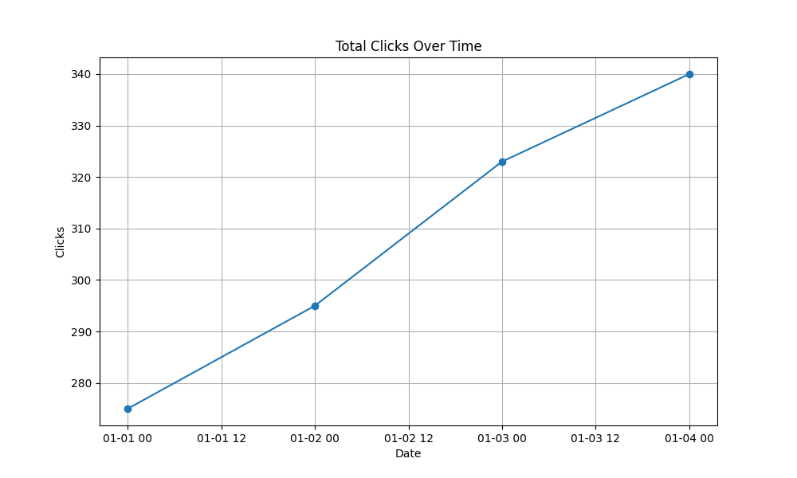
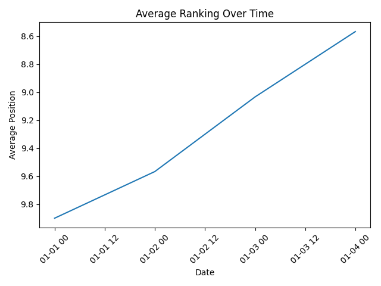
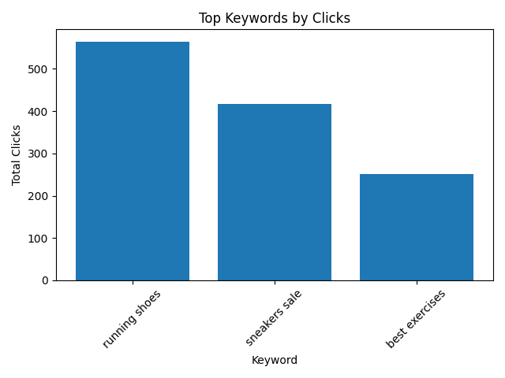

# SEO Analytics Pipeline

Welcome to the **SEO Analytics Pipeline**, a project designed to track, analyze, and visualize website SEO performance metrics. This pipeline uses **PostgreSQL** to store SEO data and **Python** to generate insightful charts that help monitor clicks, impressions, CTR, and ranking trends over time.

This project is perfect for digital marketers, SEO analysts, and developers who want to automate SEO reporting and gain actionable insights.

---

Project Overview

The pipeline enables you to:

- Store daily SEO metrics for multiple pages and keywords.  
- Analyze key SEO metrics like clicks, impressions, CTR, and average ranking.  
- Generate visualizations to track trends over time.  
- Identify top-performing keywords and pages.  
- Run custom SQL queries for deeper insights into website performance.  

---

Key Metrics Analyzed

- Website traffic over time (clicks & impressions)  
- Click-through rate (CTR) trends  
- Keyword and page performance  
- Ranking improvements or drops  

---

Charts & Insights

**Total Clicks Over Time**  

**CTR Over Time**  

**Average Ranking Over Time**  

**Top Keywords by Clicks**  

